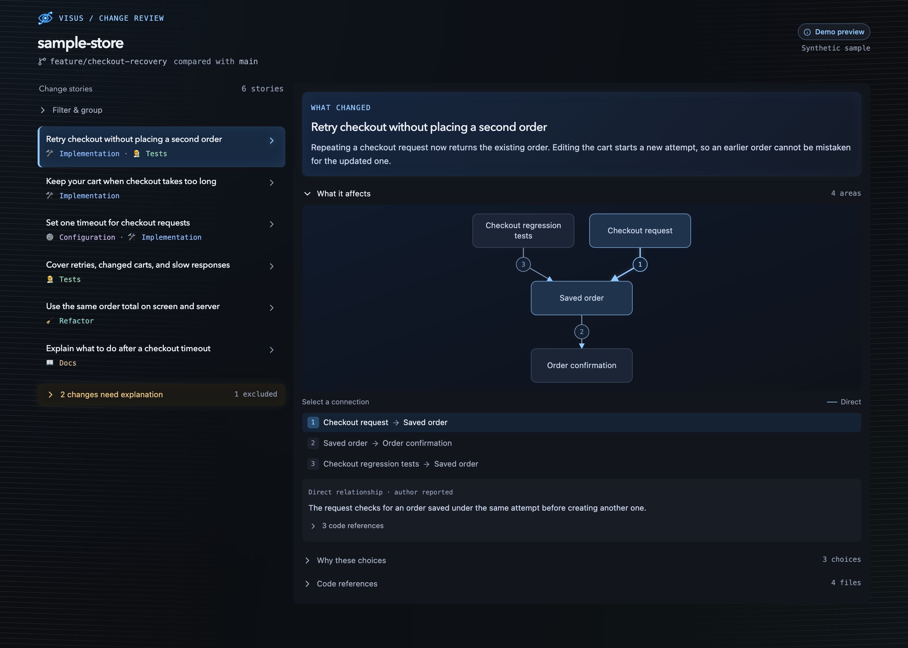

<p align="center">
  
</p>

<h1 align="center">visus</h1>

<p align="center"><strong>Review the story before the diff.</strong></p>

<p align="center">
  Agent-written, visual guides to large code changes. Understand what changed and why, then jump straight to the code. Local-first, in your browser or VS Code.
</p>

<p align="center">
  
</p>

<p align="center"><sub>Synthetic sample review rendered by the explorer's demo mode.</sub></p>

## Why visus

Large changes, especially agent-written ones, arrive as hundreds of files. A file-by-file diff shows *what* moved but not *why*, so reviewers skim and miss things.

- **Stories, not file lists.** Changes are grouped into plain-language stories, each with its outcome first and the reasoning behind it one click away.
- **See what it touches.** A connected diagram shows the areas a story affects and how they relate, marking direct and inferred links.
- **Nothing slips through.** Every change must be explained or explicitly excluded. Unexplained changes stay visible, and a review goes stale when the source moves.
- **Straight to the evidence.** Open any reference to the captured before/after code, in the browser or as a native diff in VS Code.
- **Local-first.** Reviews are plain files under `.visus/`. There is no hosted service, and the tool does not fetch, stage, or execute your project code.

## How it works

1. `visus prepare` inspects your Git worktree and writes a draft listing every change.
2. Your agent fills in the draft with stories, relationships, and exclusions, guided by the bundled Claude Code skills.
3. `visus validate` and `visus publish` check coverage and freshness, then save an immutable report revision.
4. You read the story in the browser explorer or VS Code, and open the evidence behind any claim.

## Status

Implementation is underway from the accepted six-milestone plan. The workspace includes the shared contracts and core, the file-based CLI and browser runtime, an optional MCP adapter, the React explorer, a VS Code extension, Claude Code integration files, and portable export. Runtime verification and real-host acceptance checks are still pending; release infrastructure remains undecided.

## Requirements

- Node.js 22.12 or newer (the repository selects the Node 24 LTS line) and npm 10 or newer
- Git available on `PATH`
- A Git worktree for source capture

## Build and check

```sh
npm install
npm run build
npm run typecheck
```

The packages use npm workspaces. The lockfile pins the resolved dependency tree. `npm run build` builds the shared core, browser explorer, local tools, and VS Code extension assets.

## Local review

Build once, then run these commands from the visus checkout:

```sh
node apps/local/dist/cli.js init --root /path/to/worktree
node apps/local/dist/cli.js prepare --root /path/to/worktree
node apps/local/dist/cli.js serve --root /path/to/worktree
```

Open `http://127.0.0.1:4317`. `prepare` prints the source ID, selected base, and a page of change-unit references; continue with `--offset N` and `--limit N` for large inventories. The base can be selected explicitly with `--base <ref>` and is remembered per worktree. The tool does not fetch, stage, execute project code, or alter the reviewed index.

For frontend development, run the review service and Vite in separate terminals. Vite forwards `/api` requests to the local review service on port 4317:

```sh
# Terminal 1, from the visus checkout
node apps/local/dist/cli.js serve --root /path/to/worktree

# Terminal 2, from the visus checkout
npm run dev
```

Open the Vite URL printed in the second terminal. Build first with `npm run build`; the review service reads the built explorer assets when serving the regular local review URL.

To preview the explorer with synthetic review content, start Vite with `DEMO_MODE=1 npm run dev`. The sample checkout review includes six connected stories across implementation, tests, configuration, refactor, and docs, with before/after excerpts for fourteen files, two unexplained changes, and one generated-file exclusion. Demo mode is labeled in the page and does not call the local review API. Restart with `npm run dev` to return to live review data.

Run `npm run storybook` to view the explorer's beUI controls and evidence panel stories at `http://localhost:6006`. Build the static Storybook with `npm run build-storybook`.
Generated Storybook output is excluded from the explorer's dev watcher, so rebuilding previews does not trigger unrelated page reloads.

The explorer shows the selected story's plain-language outcome first. Expand **What it affects** for named areas and visual connections, **Why these choices** for reasoning, or **Code references** for supporting files. Each story starts with these sections collapsed. The story list shows titles and categories; **Filter & group** reveals the optional organization controls. Unexplained changes remain visible as a count, with their files available on expansion. These explanations come from the published report; direct and inferred relationships remain labeled as author reported. In VS Code, opening a reference goes directly to the editor's captured diff. In the browser, it opens an optional snapshot preview.

**What it affects** uses [Dagre](https://github.com/dagrejs/dagre/wiki) to lay out a connected diagram from the report's existing relationships. Areas appear once, with solid arrows for direct connections and dashed arrows for inferred ones. Select a numbered arrow or its matching button to read one connection's explanation and expand its supporting code references. The diagram keeps readable labels and scrolls in narrow panes; other affected areas appear separately without invented connections. Rendering runs locally in the browser or VS Code webview.

The layout uses compact type and spacing for editor panes, with fewer divider lines. Headings, body text, and technical labels use distinct font roles with local fallbacks. Faint gray lines curve gently like a bent sheet of paper, fade across each outer quarter, and leave the middle half transparent. Muted category colors add depth; narrow panes keep the story list in a bounded scroll area above the selected story. Subtle, static blue glows mark the selected story and its explanation; amber highlights pending work, and red highlights stale or unavailable reviews.

The controls use local source copies of [beUI motion components](https://beui.dev/components/motion): Button, Tabs, Select, Animated Badge, and Center Morph Modal. Category filters apply to published stories; unexplained changes stay visible. Tabs and category options support arrow keys. Tab labels use one text layer and content switches without an entrance fade; buttons use a small press response without hover scaling, and status text updates without a rolling blur. Components respect the system's reduced motion setting. Storybook includes connected, inferred, summary-only, and unavailable-reference explanation previews.

The review folder is `.visus/`, ignored locally by `init`. It stores source snapshots, content-addressed evidence, immutable report revisions, and the latest pointer. Keep it local: reports and evidence may contain private source.

Existing initialized `.diff-vis/` reviews remain readable until a `.visus/` review store is initialized; drafts can use `.visus/` with either store. After updating, run `npm install`, rebuild, and run `npm link` to expose the renamed `visus` command. Refresh installed skills and hooks to use `visus`; the old `DIFF_VIS_PORT` setting remains supported alongside `VISUS_PORT`.

## Author a review file

After building and linking the CLI with `npm link`, run these commands from the worktree being reviewed:

```sh
visus prepare --base main --draft .visus/draft-01.json
# Edit the generated draft with stories, entities, and optional exclusions.
visus validate --file .visus/draft-01.json
visus publish --file .visus/draft-01.json
visus check
```

No MCP setup or server process is needed for authoring. Add `--root /path/to/worktree` when running from another directory; draft and input-file paths resolve relative to that root. `prepare --draft` generates the update ID, source ID, and expected revision and refuses to overwrite an existing file. Use a new draft filename for each changed publication. `prepare` still supports pagination; omit `--draft` when reading further pages.

The draft contains incremental updates. Complete story records replace stories with matching IDs; valid unrelated stories and entities remain. `removeStories` and `removeEntities` explicitly remove records. Omit `exclusions` to retain valid existing exclusions, or provide it to replace the list. Repeating the same unchanged publication returns the saved acknowledgment with `already-published` status rather than rechecking current source or revision; use `check` for current freshness. Editing an already published update requires a new update ID.

`validate` runs the same schema, reference, freshness, and revision checks as publication without saving a report. Its output includes coverage and pending references. Valid partial updates return `incomplete` and can be published while explanations are being written. Invalid input or stale source/revision returns a nonzero exit code. `check` requires a published, fresh, fully covered review and returns a nonzero exit code otherwise. Publication keeps atomic revision writes and the previous valid report on rejected input. Browser and VS Code viewers continue reading the published report; editing a draft does not replace it.

Run `visus schema` to print the draft JSON Schema. The generated [update schema](packages/core/schema/update.schema.json) describes authoring input; the [report schema](packages/core/schema/report.schema.json) describes published output. The [visus-change-story skill](integrations/claude/visus-change-story/SKILL.md) routes to focused workflows with shared authoring instructions and an optional synthetic example.

Choose the workflow directly to load only the instructions needed:

- `/visus-on-demand`: generate a review for local changes or a selected base. `--base HEAD` captures uncommitted changes; another base captures changes from its merge base with `HEAD`, including local edits and non-ignored untracked files.
- `/visus-pr`: resolve a PR's exact head/base commits, prepare a clean local worktree, and generate its review. This is an agent workflow using local capture; visus has no native PR URL ingestion or fetching command.
- `/visus-hook`: set up requested hooks or repair the review when a hook requests it. Hooks signal work and check status; the agent writes the explanations.

The shared contract covers preparation, incremental publication, coverage, and freshness. The JSON example and MCP instructions load only when needed. Published reports live under `.visus/reviews/<scope>/revisions/<revision>.json` (or the existing legacy `.diff-vis/` store); drafts remain separate files.

## Claude Code producer

To install the `visus-change-story` router and its three workflow skills without hooks, run:

```sh
npm run install:claude-skill -- --root /path/to/worktree
```

Omit `--root` to install into the current project, or use `--global` to make the skills available across local Claude Code projects. Both installers copy the full skill family and its references, filling missing files while preserving existing files. The skills use the file/CLI workflow by default. When migrating, compare installed files with `integrations/claude/` and refresh older instructions deliberately; rerunning installation does not overwrite customized skills. An older installed `/change-story` skill is left untouched; remove it manually once any custom guidance has been migrated to `/visus-*`.

After building, run `npm link` from this checkout to make the CLI available on `PATH`, then install the integration:

```sh
visus setup-claude --root /path/to/worktree
```

This installs the skill family and merges local Claude hooks without replacing existing entries. MCP settings are only added when `--with-mcp` is passed; existing MCP configuration is preserved. Review generated integration files before committing them. The Stop hook directs repairs to `visus-hook`, allows at most two repair continuations per source-state key, and stops blocking sooner if `stop_hook_active` is set. It then reports the unresolved status.

### Status mod

[`integrations/claude/visus-status`](integrations/claude/visus-status) is an optional Claude Code mod (Claude Code v2.1.287 or newer). Its `/visus` command runs `visus check` and opens a `visus` pane: the review status, then each story's title with an emoji for each kind of change (🔧 implementation, 🧪 tests, 🔩 config, 📝 docs, 🧹 refactor, 📦 dependencies, 🤖 generated, 📎 other), and a legend. The pane sits beside the transcript in a wide fullscreen terminal and above the prompt otherwise; Esc closes it. Once the pane has been shown, file edits mark it as edited and it checks again when Claude's turn ends; the mod runs no checks before `/visus` is used. `visus check` includes each story's ID, title, and change kinds for this purpose. The mod needs the `visus` CLI on `PATH` (`npm link`). To load it for one session:

```sh
claude --plugin-dir /path/to/visus/integrations/claude/visus-status
```

Run `claude plugin test` from the mod's directory to run its tests. The tests pass; the mod has not yet been checked in a live session.

### Optional MCP adapter

For agents that need a tool interface, opt in with `visus setup-claude --with-mcp --root /path/to/worktree`, or launch `visus mcp` through the agent's MCP configuration. The adapter exposes `prepare_review`, `publish_update`, `check_review`, and compact revision-pinned reads using the same core validation and storage as file publication.

The SDK is a development dependency and an optional runtime peer. Normal CLI commands do not load it. Development builds install it with the other development dependencies; a production-only installation can run the built CLI without it. To enable MCP in that installation, install `@modelcontextprotocol/server@2.2.0`. The current adapter uses stdio and runs alongside the agent. An agent with a server-side checkout and shell can use files and the CLI there; access across machines would require an HTTP transport, which is not implemented. Reports and captured source must still be transferred or fetched for a viewer on another machine.

## VS Code

Open this project in VS Code, run `npm run build`, and press F5 from the extension workspace to launch an Extension Development Host. Use **visus: Open Change Explorer** or **visus: Prepare Review**. The extension renders the same explorer bundle and opens historical evidence through readonly virtual documents.

## Export

```sh
visus export --scope <scope> --revision <revision> --out ./review-export
visus serve --export ./review-export
```

The export contains a report snapshot, source manifest, referenced evidence, and the viewer assets. It can be served without the original worktree. Exports are not sanitized; inspect before sharing.

## Synthetic large-change example

After building, run `npm run fixture:large -- /path/to/new-fixture` with a new output directory. It generates 200 synthetic files, 2,000 change units, and 100 illustrative stories. The fixture is not created in this repository, and performance measurements have not yet been recorded.

## Documentation

- [Report schema](packages/core/schema/report.schema.json)
- [Bionic eye icon](packages/explorer/src/assets/README.md)
- [Contributing](CONTRIBUTING.md) · [Security](SECURITY.md)

Public repository content must use synthetic examples and repository-relative paths. No private vulnerability-reporting channel or public release has been selected.

## License

Licensed under the [Apache License 2.0](LICENSE). Redistributions must keep the [NOTICE](NOTICE) file's attribution to Rodrigo Reyes.
